# 安芸カントリークラブ

## コース概要

| 項目 | 内容 |
|------|------|
| 所在地 | 広島県東広島市河内町入野11957-6 |
| 開場 | 1975年10月28日 |
| 設計 | 福井八十八 |
| コースタイプ | 丘陵コース |
| グリーン | ベント（ペンクロス）2グリーン |
| Par | 72（OUT 36 / IN 36） |
| 総距離（バック） | 6,965Y |
| 総距離（レギュラー） | 6,337Y |
| 総距離（フロント） | 6,161Y |
| コースレート | 73.1〜74.4 |
| バンカー数 | 82 |
| 高低差 | 約17-18m（全体的にフラット） |
| 特徴 | 松・杉が豊か、5カ所の池がアクセント。OUTは距離が長く飛距離勝負、INはセカンドからのラインが振られ球趣が増す |
| 公式サイト | https://www.aki-cc.net/ |
| 楽天GORA | https://booking.gora.golf.rakuten.co.jp/guide/disp/c_id/340003/ |

## 画像URL一覧

| ホール | 公式サイト画像URL | ローカル画像 |
|--------|------------------|-------------|
| 1 | https://www.aki-cc.net/course/img/1hole.jpg | images/hole01.jpg |
| 2 | https://www.aki-cc.net/course/img/2hole.jpg | images/hole02.jpg |
| 3 | https://www.aki-cc.net/course/img/3hole.jpg | images/hole03.jpg |
| 4 | https://www.aki-cc.net/course/img/4hole.jpg | images/hole04.jpg |
| 5 | https://www.aki-cc.net/course/img/5hole.jpg | images/hole05.jpg |
| 6 | https://www.aki-cc.net/course/img/6hole.jpg | images/hole06.jpg |
| 7 | https://www.aki-cc.net/course/img/7hole.jpg | images/hole07.jpg |
| 8 | https://www.aki-cc.net/course/img/8hole.jpg | images/hole08.jpg |
| 9 | https://www.aki-cc.net/course/img/9hole.jpg | images/hole09.jpg |
| 10 | https://www.aki-cc.net/course/img/10hole.jpg | images/hole10.jpg |
| 11 | https://www.aki-cc.net/course/img/11hole.jpg | images/hole11.jpg |
| 12 | https://www.aki-cc.net/course/img/12hole.jpg | images/hole12.jpg |
| 13 | https://www.aki-cc.net/course/img/13hole.jpg | images/hole13.jpg |
| 14 | https://www.aki-cc.net/course/img/14hole.jpg | images/hole14.jpg |
| 15 | https://www.aki-cc.net/course/img/15hole.jpg | images/hole15.jpg |
| 16 | https://www.aki-cc.net/course/img/16hole.jpg | images/hole16.jpg |
| 17 | https://www.aki-cc.net/course/img/17hole.jpg | images/hole17.jpg |
| 18 | https://www.aki-cc.net/course/img/18hole.jpg | images/hole18.jpg |

## ホール詳細

### OUTコース（Par 36 / バック 3,570Y / レギュラー 3,092Y）

#### 1番 Par 4 | HDCP 3 | ストレート
| バック | レギュラー | フロント |
|--------|------------|---------|
| 426Y | 395Y | 348Y |

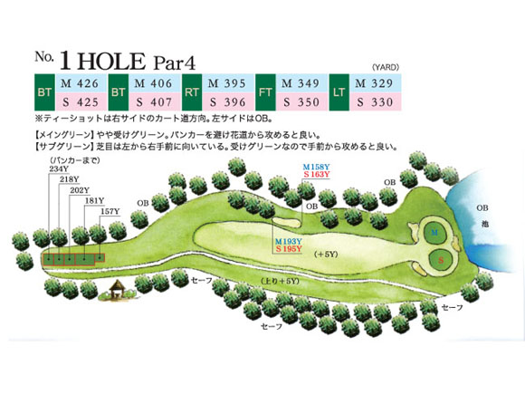

- **ハザード:** グリーン奥に池、ガードバンカー
- **OB:** 左側OB
- **攻略:** ティーショットは右カート道方向狙い。受けグリーン、奥の池があるためオーバー禁物。難易度コース内1位級。平均スコア5.78。

#### 2番 Par 4 | HDCP 7 | ストレート
| バック | レギュラー | フロント |
|--------|------------|---------|
| 419Y | 359Y | 359Y |

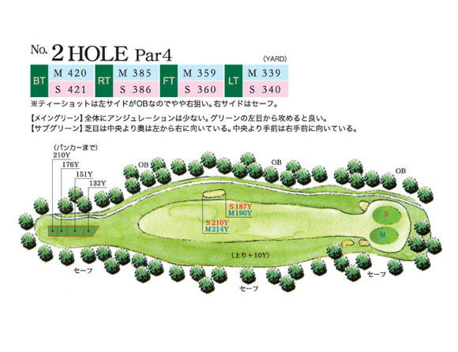

- **ハザード:** クロスバンカー
- **OB:** 左側OB（OB率32%）
- **攻略:** やや右狙い。左OB回避が最優先。

#### 3番 Par 3 | HDCP 15 | 打ち下ろし
| バック | レギュラー | フロント |
|--------|------------|---------|
| 177Y | 156Y | 138Y |

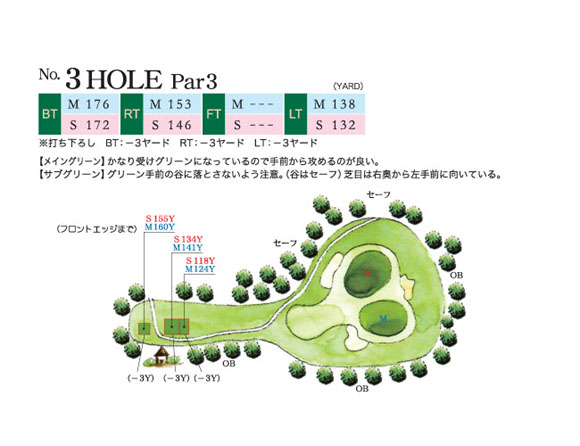

- **ハザード:** ガードバンカー
- **OB:** 右側OB
- **攻略:** 打ち下ろしのショートホール。受けグリーン、手前から攻める。

#### 4番 Par 4 | HDCP 9 | ストレート | 打ち下ろし
| バック | レギュラー | フロント |
|--------|------------|---------|
| 438Y | 395Y | 395Y |

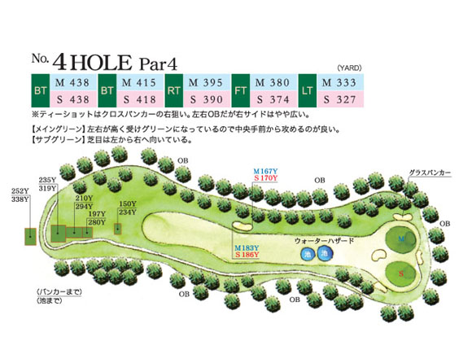

- **ハザード:** クロスバンカー、セカンド地点に池
- **OB:** 左右OB
- **攻略:** クロスバンカーの右狙い。左右OBあり距離も長い難ホール。

#### 5番 Par 4 | HDCP 5 | 右ドッグレッグ | やや打ち上げ
| バック | レギュラー | フロント |
|--------|------------|---------|
| 378Y | 328Y | 330Y |

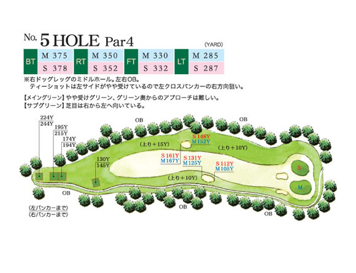

- **ハザード:** 左右クロスバンカー
- **OB:** 左右OB
- **攻略:** 右ドッグレッグ。両サイドOBが効いており正確なティーショットが求められる。

#### 6番 Par 5 | HDCP 17 | 左ドッグレッグ | やや打ち上げ
| バック | レギュラー | フロント |
|--------|------------|---------|
| 532Y | 487Y | 477Y |

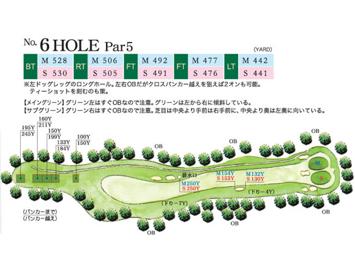

- **ハザード:** 大型ガードバンカー
- **OB:** 左右OB、特に左グリーン近辺
- **攻略:** 左ドッグレッグのロングホール。グリーン周辺の左OBに注意。

#### 7番 Par 3 | HDCP 11 | 打ち下ろし
| バック | レギュラー | フロント |
|--------|------------|---------|
| 190Y | 152Y | 113Y |

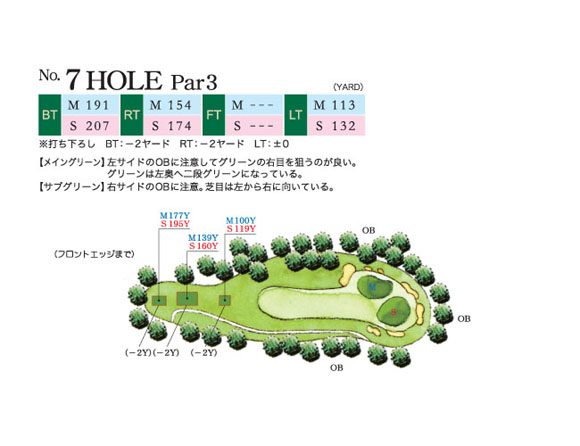

- **ハザード:** 左ガードバンカー
- **OB:** 左OB
- **攻略:** 打ち下ろしのショート。二段グリーンのピン位置に注意。左OBに注意。

#### 8番 Par 4 | HDCP 1 | ストレート（コース最難関）
| バック | レギュラー | フロント |
|--------|------------|---------|
| 444Y | 299Y | 282Y |

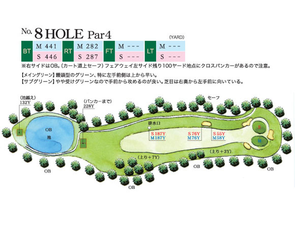

- **ハザード:** クロスバンカー（100Y地点）、池越え
- **OB:** 右側OB
- **攻略:** コース最難関（HDCP 1）。バックから444Yと距離が長い。饅頭型（砲台）グリーンは乗せるのが難しい。

#### 9番 Par 5 | HDCP 13 | ストレート
| バック | レギュラー | フロント |
|--------|------------|---------|
| 566Y | 521Y | 516Y |

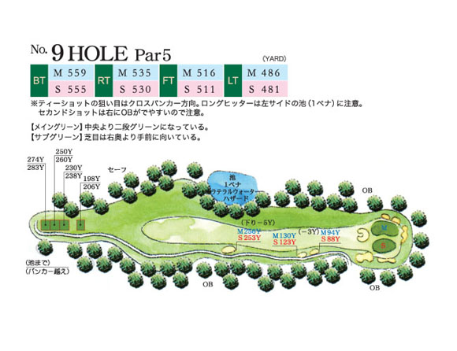

- **ハザード:** 左に池、クロスバンカー
- **OB:** 右OB（セカンド付近）
- **攻略:** 距離のあるロングホール。左の池と右OBの間を通す。二段グリーン。

---

### INコース（Par 36 / バック 3,395Y / レギュラー 3,069Y）

#### 10番 Par 5 | HDCP 16 | 左ドッグレッグ
| バック | レギュラー | フロント |
|--------|------------|---------|
| 529Y | 458Y | 459Y |

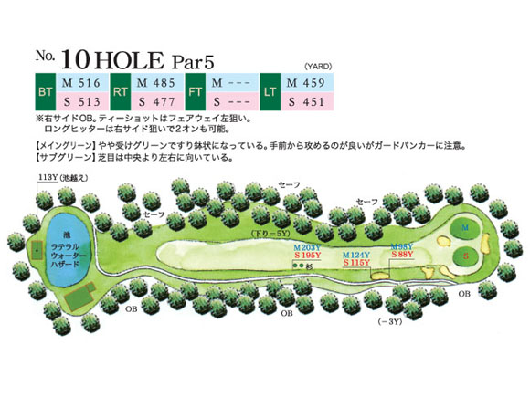

- **OB:** 右側OB（OB率43%）
- **攻略:** ティーショットはFW左狙い。右OBが非常に効いている。すり鉢状受けグリーン。

#### 11番 Par 4 | HDCP 2 | ストレート
| バック | レギュラー | フロント |
|--------|------------|---------|
| 404Y | 378Y | 322Y |

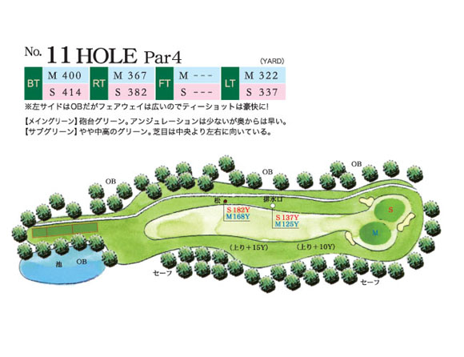

- **OB:** 左側OB
- **攻略:** HDCP 2の難ホール。FWは広めだが左OBに注意。砲台グリーンへのアプローチが鍵。

#### 12番 Par 4 | HDCP 8 | S字
| バック | レギュラー | フロント |
|--------|------------|---------|
| 397Y | 336Y | 314Y |

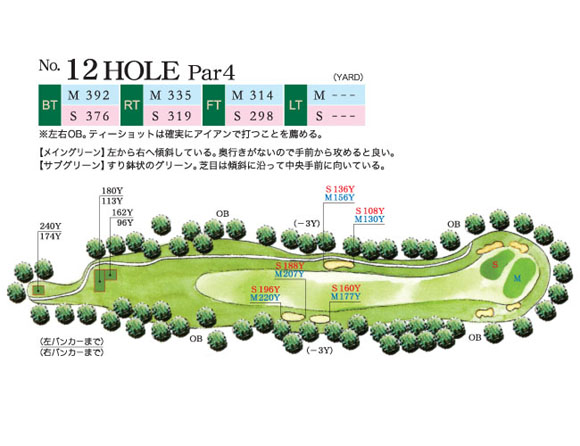

- **OB:** 左右OB（OB率59%）
- **攻略:** S字のミドル。短距離だがOB率59%と極めて高い。正確なショット必須。

#### 13番 Par 4 | HDCP 10 | 左ドッグレッグ
| バック | レギュラー | フロント |
|--------|------------|---------|
| 392Y | 380Y | 301Y |

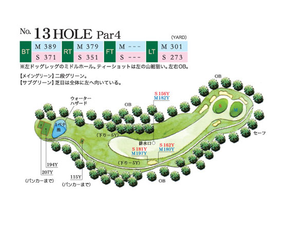

- **ハザード:** 池越え、バンカー
- **OB:** 左右OB
- **攻略:** 左ドッグレッグで池越えのミドルホール。

#### 14番 Par 3 | HDCP 4 | 打ち下ろし
| バック | レギュラー | フロント |
|--------|------------|---------|
| 200Y | 157Y | 144Y |

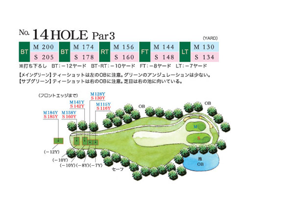

- **OB:** 左OB（OB率41%）
- **攻略:** 打ち下ろしのショート。難易度は最も易しい（18位）だが、バックから200Yあり左OBに注意。

#### 15番 Par 5 | HDCP 18 | 左ドッグレッグ
| バック | レギュラー | フロント |
|--------|------------|---------|
| 524Y | 501Y | 469Y |

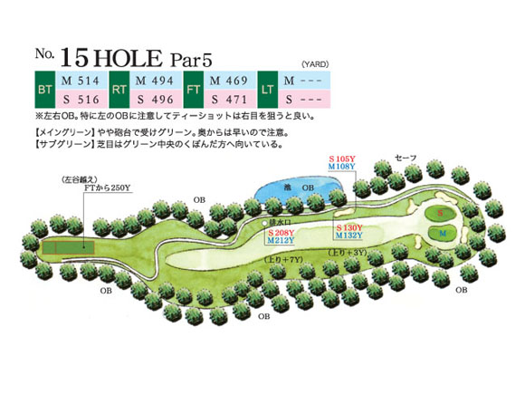

- **ハザード:** ガードバンカー
- **OB:** 左右OB（OB率50%）
- **攻略:** 実質難易度2位の難ホール。左右OB率50%。砲台受けグリーンへの正確なアプローチが必要。平均スコア6.88。

#### 16番 Par 3 | HDCP 12 | やや打ち上げ
| バック | レギュラー | フロント |
|--------|------------|---------|
| 141Y | 125Y | 99Y |

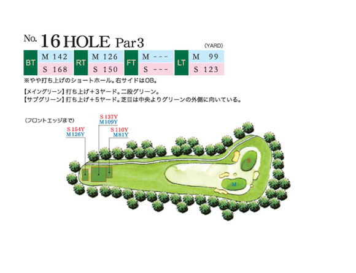

- **ハザード:** バンカー（バンカー率37%）
- **OB:** 右OB
- **攻略:** 短いショートだがバンカー率高め。二段グリーンのピン位置に注意。

#### 17番 Par 4 | HDCP 6 | ストレート
| バック | レギュラー | フロント |
|--------|------------|---------|
| 419Y | 392Y | 376Y |

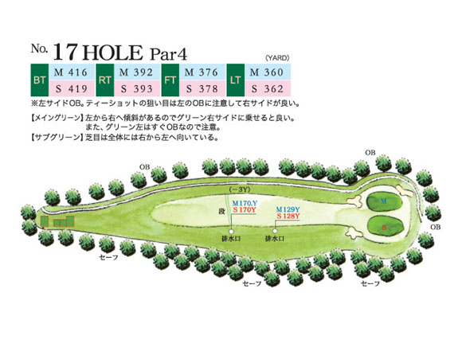

- **OB:** 左OB（OB率35%）
- **攻略:** 距離が長いストレートミドル。左OBに注意。

#### 18番 Par 4 | HDCP 14 | ストレート | 打ち下ろし
| バック | レギュラー | フロント |
|--------|------------|---------|
| 389Y | 380Y | 363Y |

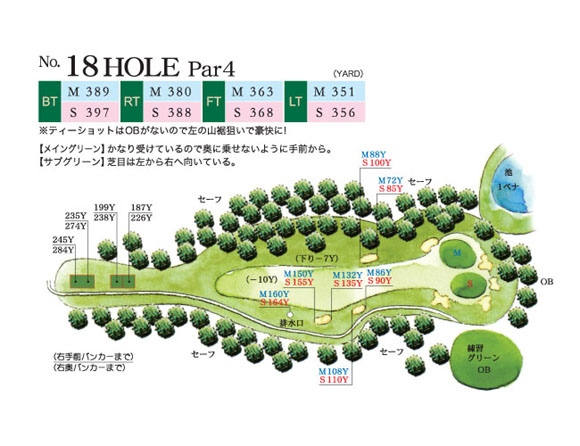

- **ハザード:** 左ガードバンカー（バンカー率40%）
- **攻略:** OBなし（OB率最低11%）。左山裾狙いで攻められる。セカンドは打ち下ろし。

---

## コース攻略まとめ

| 項目 | 内容 |
|------|------|
| 最難関ホール | 8番（HDCP 1）、11番（HDCP 2） |
| 実質難易度上位 | 1番（平均5.78）、15番（平均6.88・OB率50%） |
| 最易ホール | 14番（難易度18位）、16番（難易度17位） |
| OB率が高いホール | 12番(59%)、15番(50%)、10番(43%)、14番(41%) |
| 池が絡むホール | 1番（グリーン奥）、4番（セカンド地点）、8番（池越え）、9番（左）、13番（池越え） |
| ドラコン推奨 | OUT 2番、IN 11番 |
| ニアピン推奨 | OUT 4番、IN 12番 |
| 全体的な特徴 | 全体的にフラット（高低差17-18m）。バンカー82個と多い。OUTは距離勝負、INはコースマネジメント重視 |
| 注意点 | 2グリーン制のためティーによりレギュラー距離が変動。レディースティーデータは未取得 |
