# 宇部72カントリークラブ 阿知須コース

## コース概要

| 項目 | 内容 |
|------|------|
| 所在地 | 山口県山口市 |
| 開場 | 1960年10月29日 |
| 設計 | 上田治 |
| コースタイプ | 林間コース |
| グリーン | 2グリーン（バミューダ [2015年新設] / ベント） |
| Par | 73（OUT 36 / IN 37） |
| 総距離（バック） | 7,167Y |
| 総距離（レギュラー） | 6,795Y |
| 総距離（レディース） | 5,546Y |
| コースレート | 73.8（ベント） |
| 特徴 | フェアウェイが広く雄大な林間コース。打ち下ろしが多い。距離が長めで上田治設計の豪快さが味わえる |
| 公式サイト | https://www.ube72cc.com/course_ajisu/ |
| 楽天GORA | https://booking.gora.golf.rakuten.co.jp/guide/disp/c_id/350005 |

## 画像URL一覧

| ホール | 公式サイト画像URL | ローカル画像 |
|--------|------------------|-------------|
| 1 | https://www.ube72cc.com/wp/wp-content/uploads/2016/11/ajisu_course01.jpg | images/hole01.jpg |
| 2 | https://www.ube72cc.com/wp/wp-content/uploads/2016/11/ajisu_course02.jpg | images/hole02.jpg |
| 3 | https://www.ube72cc.com/wp/wp-content/uploads/2016/11/ajisu_course03.jpg | images/hole03.jpg |
| 4 | https://www.ube72cc.com/wp/wp-content/uploads/2016/11/ajisu_course04.jpg | images/hole04.jpg |
| 5 | https://www.ube72cc.com/wp/wp-content/uploads/2016/11/ajisu_course05.jpg | images/hole05.jpg |
| 6 | https://www.ube72cc.com/wp/wp-content/uploads/2016/11/ajisu_course06.jpg | images/hole06.jpg |
| 7 | https://www.ube72cc.com/wp/wp-content/uploads/2016/11/ajisu_course07.jpg | images/hole07.jpg |
| 8 | https://www.ube72cc.com/wp/wp-content/uploads/2016/11/ajisu_course08.jpg | images/hole08.jpg |
| 9 | https://www.ube72cc.com/wp/wp-content/uploads/2016/11/ajisu_course09.jpg | images/hole09.jpg |
| 10 | https://www.ube72cc.com/wp/wp-content/uploads/2016/11/ajisu_course10.jpg | images/hole10.jpg |
| 11 | https://www.ube72cc.com/wp/wp-content/uploads/2016/11/ajisu_course11.jpg | images/hole11.jpg |
| 12 | https://www.ube72cc.com/wp/wp-content/uploads/2016/11/ajisu_course12.jpg | images/hole12.jpg |
| 13 | https://www.ube72cc.com/wp/wp-content/uploads/2016/11/ajisu_course13.jpg | images/hole13.jpg |
| 14 | https://www.ube72cc.com/wp/wp-content/uploads/2016/11/ajisu_course14.jpg | images/hole14.jpg |
| 15 | https://www.ube72cc.com/wp/wp-content/uploads/2016/11/ajisu_course15.jpg | images/hole15.jpg |
| 16 | https://www.ube72cc.com/wp/wp-content/uploads/2016/11/ajisu_course16.jpg | images/hole16.jpg |
| 17 | https://www.ube72cc.com/wp/wp-content/uploads/2016/11/ajisu_course17.jpg | images/hole17.jpg |
| 18 | https://www.ube72cc.com/wp/wp-content/uploads/2016/11/ajisu_course18.jpg | images/hole18.jpg |

## ホール詳細

### OUTコース（Par 36 / バック 3,562Y / レギュラー 3,370Y）

#### 1番 Par 4 | HDCP 5 | ストレート | 打ち上げ
| バック | レギュラー | レディース |
|--------|------------|------------|
| 432Y | 420Y | 321Y |

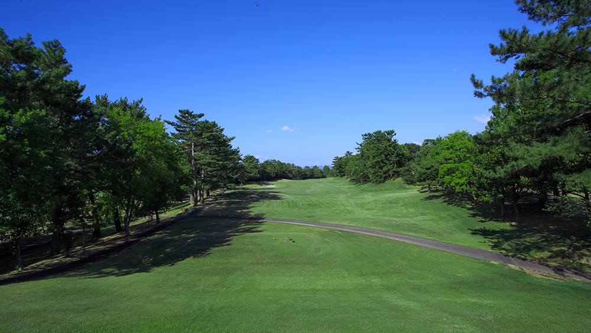

- **攻略:** 2打目が打ち上げ。受けグリーン。フェアウェイキープすればさほど難しくなくパーが取れる。高い球筋で攻めるのが有効。
- **難易度:** GDOデータ1位（最難） / 平均スコア 5.78

#### 2番 Par 5 | HDCP 7 | ストレート
| バック | レギュラー | レディース |
|--------|------------|------------|
| 570Y | 540Y | 477Y |

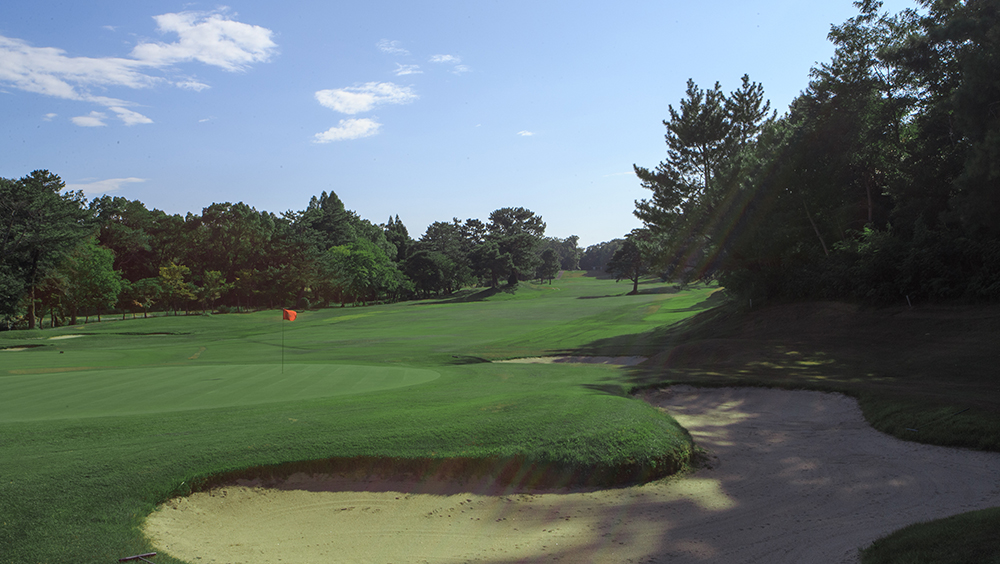

- **ハザード:** フェアウェイ右前方に林がスタイミーになる
- **攻略:** ティーショットはセンターやや左狙い。右サイドからは前方の林が邪魔になりスライスで攻める必要あり。ドラコン推奨。
- **難易度:** 3位 / 平均スコア 6.72

#### 3番 Par 4 | HDCP 17 | ストレート | 打ち上げ
| バック | レギュラー | レディース |
|--------|------------|------------|
| 420Y | 385Y | 293Y |

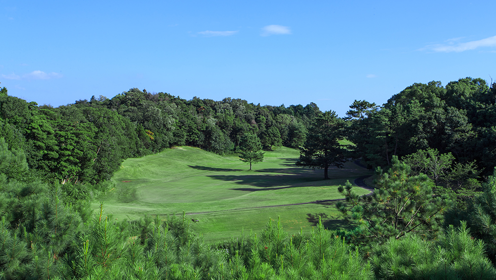

- **ハザード:** 池越え要素あり
- **OB:** 右サイドのOBラインが見た目以上に張り出し
- **攻略:** 距離より方向性重視。受けグリーンへの打ち上げでオーバーは禁物。
- **難易度:** 6位 / 平均スコア 5.65

#### 4番 Par 3 | HDCP 15 | ストレート
| バック | レギュラー | レディース |
|--------|------------|------------|
| 200Y | 180Y | 150Y |

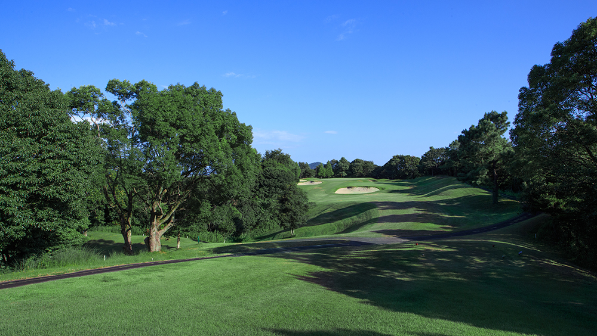

- **ハザード:** グリーン両サイドにアゴの高いバンカー
- **OB:** 左バンカーの奥
- **攻略:** 直接グリーンを狙うより手前から攻めてパーを拾う戦略が有効。ニアピン推奨。
- **難易度:** 14位 / 平均スコア 4.27

#### 5番 Par 4 | HDCP 3 | ストレート
| バック | レギュラー | レディース |
|--------|------------|------------|
| 405Y | 390Y | 293Y |

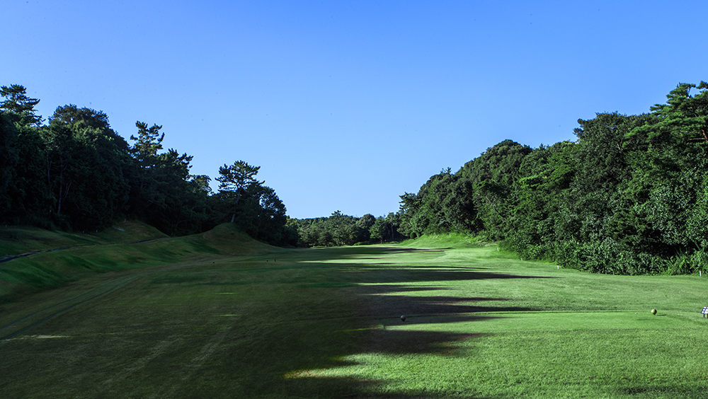

- **ハザード:** ティー前方200ydに小高い林
- **OB:** 右サイド
- **攻略:** 右OBを避けて左サイド狙い。200yd先の林を越えれば視界が開ける。
- **難易度:** 7位 / 平均スコア 5.68

#### 6番 Par 4 | HDCP 11 | ストレート | 打ち下ろし
| バック | レギュラー | レディース |
|--------|------------|------------|
| 420Y | 405Y | 375Y |

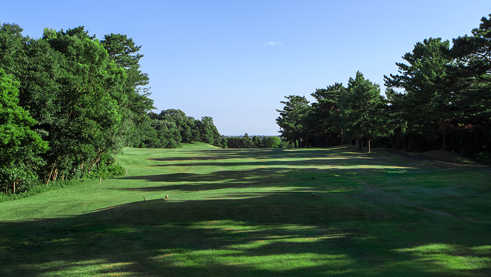

- **攻略:** ランディングエリアは見た目より狭い。球筋をイメージしてから打つこと。2打目はやや打ち下ろしで距離感が重要。
- **難易度:** 5位 / 平均スコア 5.66

#### 7番 Par 4 | HDCP 9 | ストレート
| バック | レギュラー | レディース |
|--------|------------|------------|
| 410Y | 400Y | 345Y |

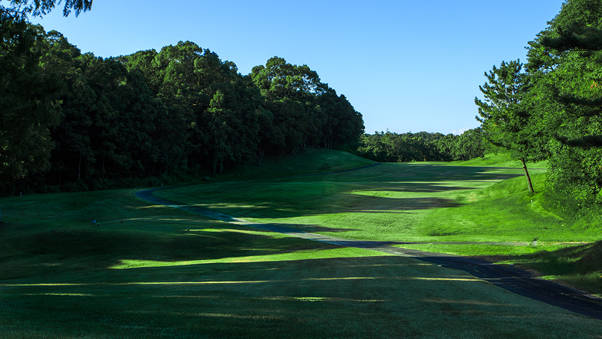

- **ハザード:** グリーン左サイドにバンカー、奥に林
- **攻略:** フェアウェイは見た目より右にある。グリーンは右手前から攻めるのが正解。
- **難易度:** 8位 / 平均スコア 5.60

#### 8番 Par 3 | HDCP 1 | ストレート
| バック | レギュラー | レディース |
|--------|------------|------------|
| 190Y | 175Y | 135Y |

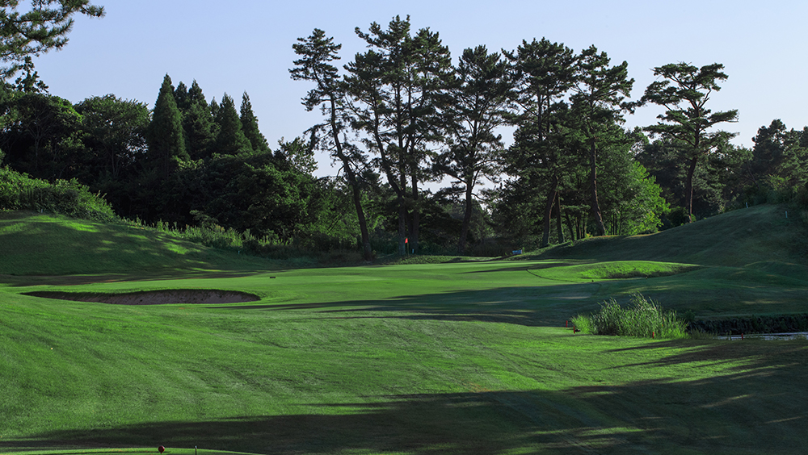

- **ハザード:** グリーン右手前にバンカー、池が絡む
- **攻略:** ティーに立つと風向きが逆に感じるため実際の風向きに注意。左に外すと逆目のアプローチが残る。手前から攻めるのが安全。
- **難易度:** 17位 / 平均スコア 4.22

#### 9番 Par 5 | HDCP 15 | ストレート
| バック | レギュラー | レディース |
|--------|------------|------------|
| 515Y | 475Y | 445Y |

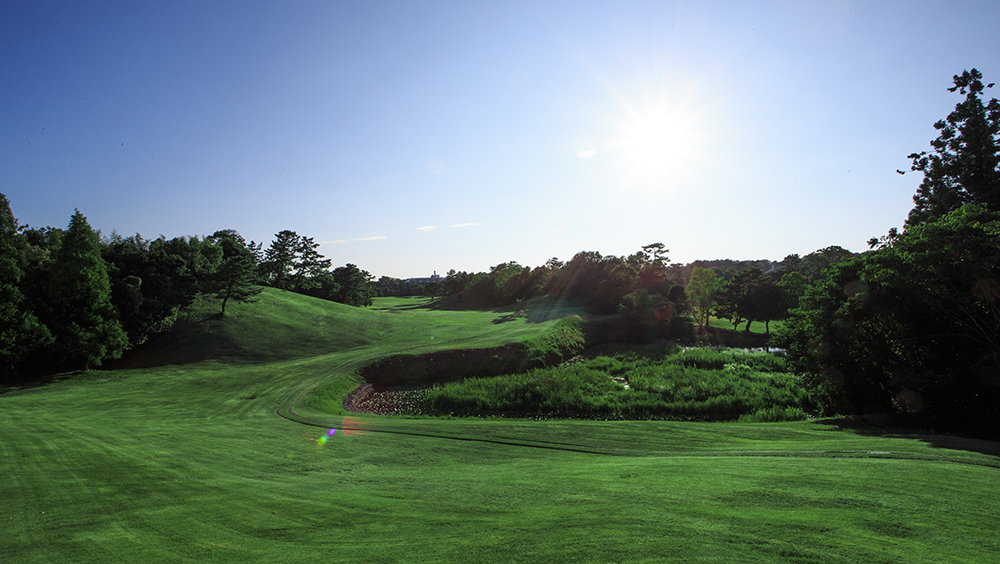

- **ハザード:** 左右クロスバンカー、池
- **攻略:** ティーショットで左右のクロスバンカーを避けてフェアウェイに打てれば2オンも狙える。
- **難易度:** 15位 / 平均スコア 6.22

---

### INコース（Par 37 / バック 3,605Y / レギュラー 3,425Y）

#### 10番 Par 4 | HDCP 4 | ストレート | 打ち上げ
| バック | レギュラー | レディース |
|--------|------------|------------|
| 385Y | 375Y | 272Y |

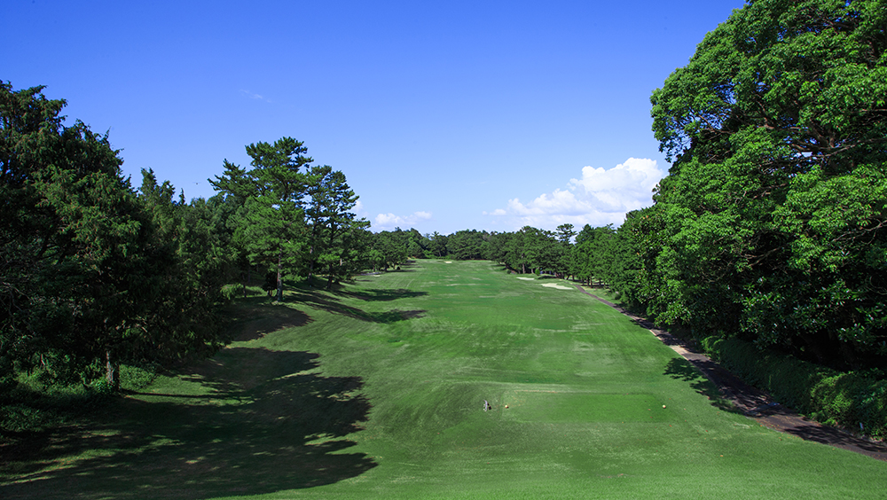

- **攻略:** フェアウェイキープが前提。2打目は打ち上げで距離感が重要。高い球筋で攻める。
- **難易度:** 9位 / 平均スコア 5.61

#### 11番 Par 5 | HDCP 2 | ストレート（コース最長）
| バック | レギュラー | レディース |
|--------|------------|------------|
| 605Y | 570Y | 422Y |

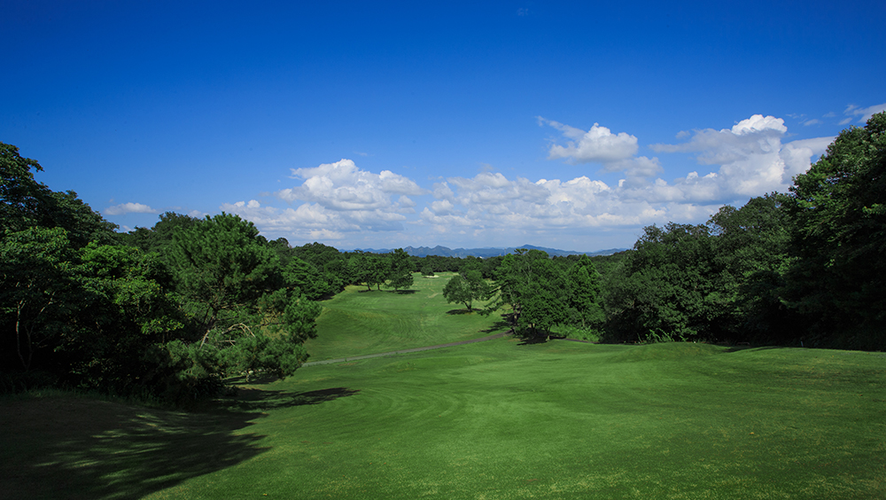

- **ハザード:** 左サイドバンカー
- **攻略:** 目印の三本松を目標にティーショットは右サイド狙い。見た目より右に広い。2打目はFWが広がるので距離を稼ぐ。ドラコン推奨。
- **難易度:** 2位 / 平均スコア 6.71

#### 12番 Par 3 | HDCP 18 | ストレート（コース最易）
| バック | レギュラー | レディース |
|--------|------------|------------|
| 150Y | 140Y | 135Y |

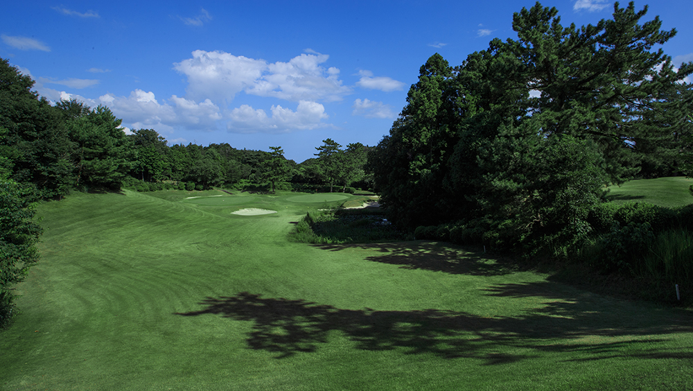

- **攻略:** ショートアイアンで確実にグリーンオン。パー・バーディーを狙いたいホール。ニアピン推奨。
- **難易度:** 18位（最易） / 平均スコア 4.07

#### 13番 Par 4 | HDCP 16 | 左ドッグレッグ
| バック | レギュラー | レディース |
|--------|------------|------------|
| 430Y | 415Y | 364Y |

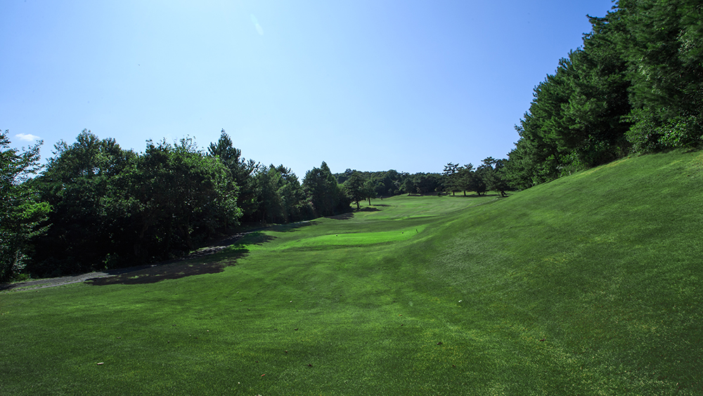

- **ハザード:** カート道左に注意
- **攻略:** 左ドッグレッグ。ティーショットはフェアウェイ左サイド狙い。砲台グリーンへ高い球で攻める。
- **難易度:** 10位 / 平均スコア 5.59

#### 14番 Par 4 | HDCP 6 | ストレート | 打ち上げ
| バック | レギュラー | レディース |
|--------|------------|------------|
| 430Y | 410Y | 283Y |

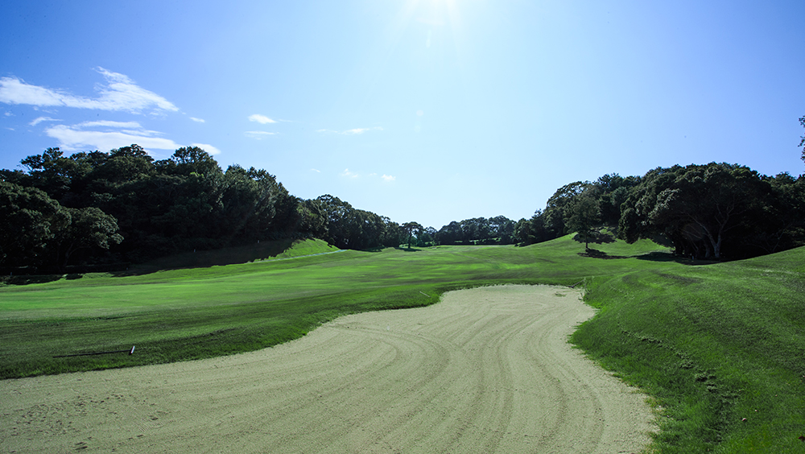

- **攻略:** FWは広いが右に行くと距離が残る。左サイド狙い。2打目は打ち上げで小さいグリーンに対してピンに寄せにくい。無理せずパー狙い。
- **難易度:** 4位 / 平均スコア 5.69

#### 15番 Par 4 | HDCP 10 | ストレート | 打ち下ろし
| バック | レギュラー | レディース |
|--------|------------|------------|
| 405Y | 365Y | 274Y |

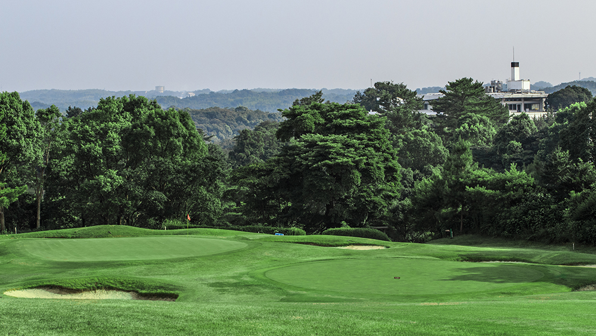

- **攻略:** 打ち下ろしのティーショット。距離は短めだがグリーンが小さいため距離感が勝負。右サイドにポジションを取ればウェッジで攻められる。
- **難易度:** 11位 / 平均スコア 5.46

#### 16番 Par 5 | HDCP 14 | ストレート | 打ち上げ
| バック | レギュラー | レディース |
|--------|------------|------------|
| 490Y | 470Y | 392Y |

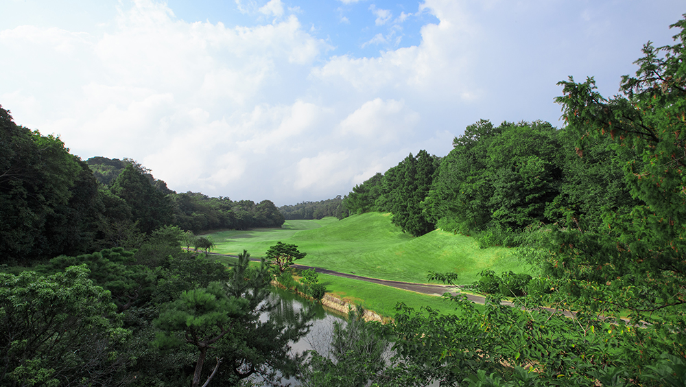

- **攻略:** ティーショットはFW右サイド狙い。3打目が打ち上げブラインドでグリーン面が見えないが、バーディチャンスにつけたい。
- **難易度:** 12位 / 平均スコア 6.41

#### 17番 Par 3 | HDCP 8 | ストレート
| バック | レギュラー | レディース |
|--------|------------|------------|
| 185Y | 175Y | 158Y |

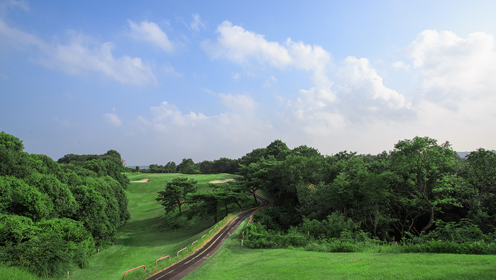

- **攻略:** 砲台グリーン。キャリーでグリーン面に落とす必要あり。転がしでは届かない。左ミスは特に厳しい。
- **難易度:** 13位 / 平均スコア 4.31

#### 18番 Par 5 | HDCP 12 | ストレート | 打ち上げ
| バック | レギュラー | レディース |
|--------|------------|------------|
| 525Y | 505Y | 412Y |

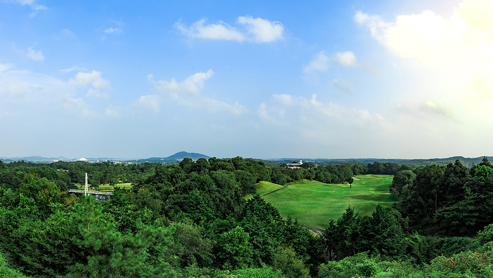

- **ハザード:** ティーショット落下地点にバンカー
- **攻略:** バンカーを避けて右から攻める。2打目は打ち下ろしでFWが広い。3打目は砲台グリーンへの正確なアプローチが求められる。
- **難易度:** 16位 / 平均スコア 6.21

---

## コース攻略まとめ

| 項目 | 内容 |
|------|------|
| 最難関ホール | 1番（平均5.78）、11番（HDCP 2・平均6.71） |
| 最易ホール | 12番（HDCP 18・平均4.07） |
| 400Y超のPar4 | 1番(420Y)、3番(385Y)、6番(405Y)、7番(400Y)、13番(415Y)、14番(410Y) |
| 池が絡むホール | 3番、8番、9番 |
| ドラコン推奨 | OUT 2番、IN 11番 |
| ニアピン推奨 | OUT 4番、IN 12番 |
| コース最長 | 11番 Par5（レギュラー570Y / バック605Y） |
| 全体的な特徴 | 距離が長い林間コース（Par 73）。打ち上げホールが多く、砲台グリーンも複数。FWは広いが見た目とのギャップに注意 |
| 注意点 | HDCP値はソースにより差異あり（公式サイトとShot Naviで異なる）。本データは公式サイトの値を採用 |
