# 宇部72カントリークラブ 万年池西コース

## コース概要

| 項目 | 内容 |
|------|------|
| 所在地 | 山口県山口市 |
| 開場 | 1975年10月1日 |
| 設計 | 牧場跡地を利用した丘陵コース |
| グリーン | バミューダ/ベント 2グリーン制 |
| Par | 72（OUT 36 / IN 36） |
| 総距離（バック） | 6,842Y |
| 総距離（レギュラー） | 6,490Y |
| 総距離（レディース） | 6,005Y |
| コースレート | 72.5（ベント） |
| 特徴 | フェアウェイが広くフラットな設計。池やバンカーが戦略的に配置 |
| トーナメント実績 | 1995年日本女子オープン、1997年宇部興産オープン、2011年おいでませ山口国体女子の部 |
| 公式サイト | https://www.ube72cc.com/course_west/ |
| 楽天GORA | https://booking.gora.golf.rakuten.co.jp/guide/disp/c_id/350006/ |

## 画像URL一覧

| ホール | 公式サイト画像URL | ローカル画像 |
|--------|------------------|-------------|
| 1 | https://www.ube72cc.com/wp/wp-content/uploads/2016/11/west_course01.jpg | images/hole01.jpg |
| 2 | https://www.ube72cc.com/wp/wp-content/uploads/2016/11/west_course02.jpg | images/hole02.jpg |
| 3 | https://www.ube72cc.com/wp/wp-content/uploads/2016/11/west_course03.jpg | images/hole03.jpg |
| 4 | https://www.ube72cc.com/wp/wp-content/uploads/2016/11/west_course04.jpg | images/hole04.jpg |
| 5 | https://www.ube72cc.com/wp/wp-content/uploads/2016/11/west_course05.jpg | images/hole05.jpg |
| 6 | https://www.ube72cc.com/wp/wp-content/uploads/2016/11/west_course06.jpg | images/hole06.jpg |
| 7 | https://www.ube72cc.com/wp/wp-content/uploads/2016/11/west_course07.jpg | images/hole07.jpg |
| 8 | https://www.ube72cc.com/wp/wp-content/uploads/2016/11/west_course08.jpg | images/hole08.jpg |
| 9 | https://www.ube72cc.com/wp/wp-content/uploads/2016/11/west_course09.jpg | images/hole09.jpg |
| 10 | https://www.ube72cc.com/wp/wp-content/uploads/2016/11/west_course10.jpg | images/hole10.jpg |
| 11 | https://www.ube72cc.com/wp/wp-content/uploads/2016/11/west_course11.jpg | images/hole11.jpg |
| 12 | https://www.ube72cc.com/wp/wp-content/uploads/2016/11/west_course12.jpg | images/hole12.jpg |
| 13 | https://www.ube72cc.com/wp/wp-content/uploads/2016/11/west_course13.jpg | images/hole13.jpg |
| 14 | https://www.ube72cc.com/wp/wp-content/uploads/2016/11/west_course14.jpg | images/hole14.jpg |
| 15 | https://www.ube72cc.com/wp/wp-content/uploads/2016/11/west_course15.jpg | images/hole15.jpg |
| 16 | https://www.ube72cc.com/wp/wp-content/uploads/2016/11/west_course16.jpg | images/hole16.jpg |
| 17 | https://www.ube72cc.com/wp/wp-content/uploads/2016/11/west_course17.jpg | images/hole17.jpg |
| 18 | https://www.ube72cc.com/wp/wp-content/uploads/2016/11/west_course18.jpg | images/hole18.jpg |

## ホール詳細

### OUTコース（Par 36 / バック 3,319Y / レギュラー 3,164Y）

#### 1番 Par 5 | HDCP 5 | 右ドッグレッグ
| バック | レギュラー | レディース |
|--------|------------|------------|
| 510Y | 487Y | 476Y |

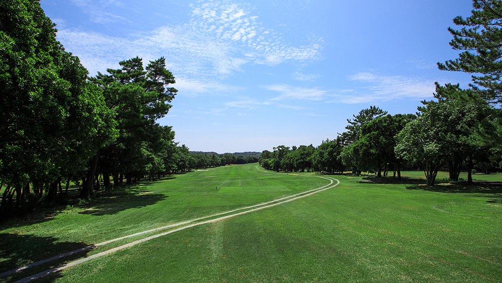

- **ハザード:** 左クロスバンカー
- **OB:** 右側OB
- **攻略:** 右ドッグレッグのロングホール。左目が安全ルート。右に曲げるとOBの危険あり。

#### 2番 Par 4 | HDCP 7 | ストレート | 打ち上げ
| バック | レギュラー | レディース |
|--------|------------|------------|
| 384Y | 364Y | 355Y |

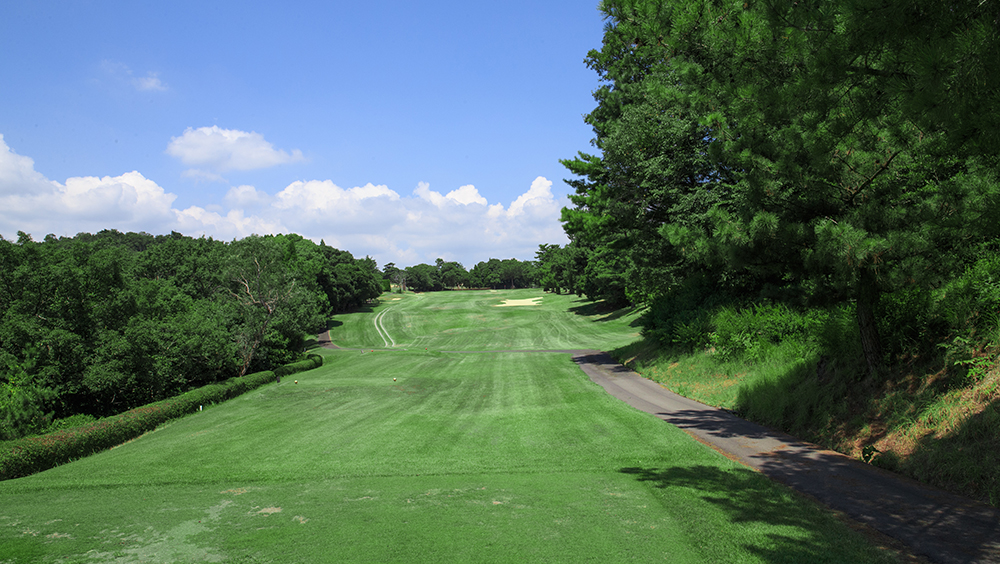

- **ハザード:** 右クロスバンカー
- **OB:** 左側OB
- **攻略:** ストレートな打ち上げミドル。左OBに注意しつつ、右のクロスバンカーを避けてフェアウェイキープ。

#### 3番 Par 3 | HDCP 17 | ストレート
| バック | レギュラー | レディース |
|--------|------------|------------|
| 152Y | 138Y | 129Y |

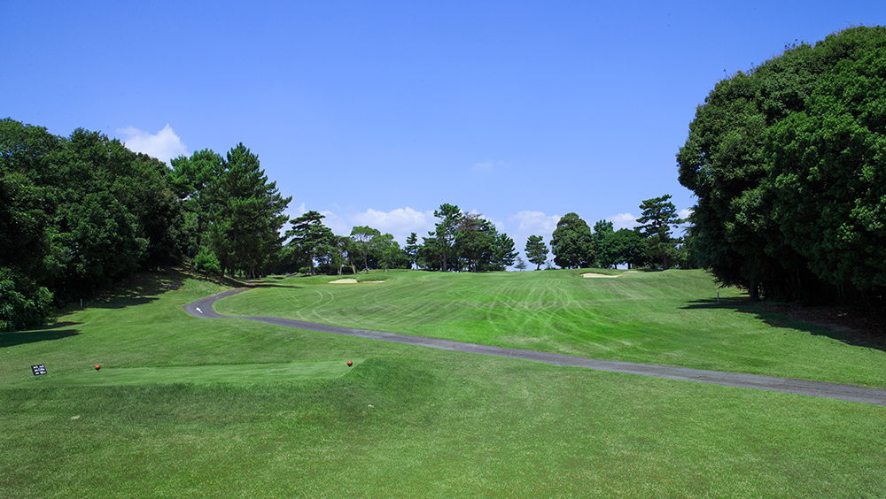

- **ハザード:** グリーン右にアゴの高いバンカー2つ
- **攻略:** 左狙いが安全なショートホール。右のバンカーは深く脱出困難。

#### 4番 Par 4 | HDCP 13 | 右ドッグレッグ
| バック | レギュラー | レディース |
|--------|------------|------------|
| 370Y | 353Y | 335Y |

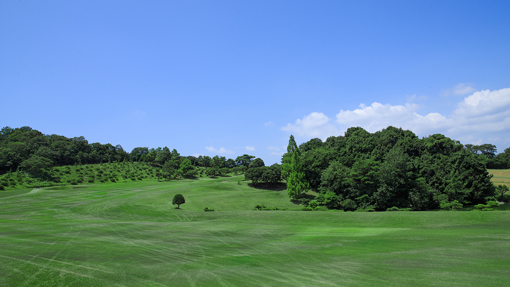

- **ハザード:** 右サイドに池、左サイドにバンカー
- **攻略:** ほぼ直角の右ドッグレッグ。飛ばし屋は池越えショートカット可能だがリスク大。セカンドの距離を残す判断が重要。

#### 5番 Par 5 | HDCP 3 | ストレート | 打ち下ろし
| バック | レギュラー | レディース |
|--------|------------|------------|
| 520Y | 504Y | 470Y |

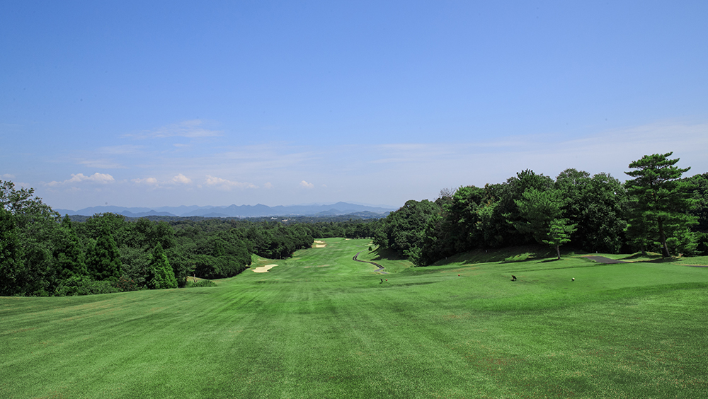

- **ハザード:** 左右クロスバンカー
- **攻略:** 打ち下ろしロング。風の影響大。ドラコン推奨ホール。クラブ選択が鍵。

#### 6番 Par 4 | HDCP 11 | 左ドッグレッグ
| バック | レギュラー | レディース |
|--------|------------|------------|
| 382Y | 366Y | 360Y |

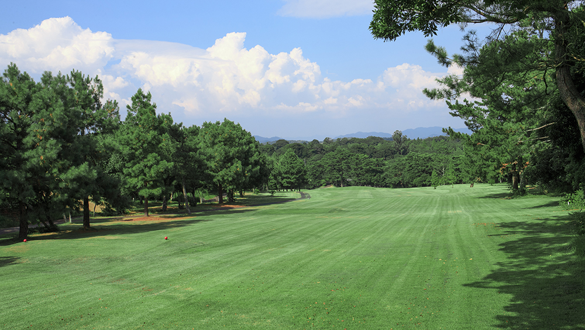

- **OB:** グリーン奥OB
- **攻略:** 左ドッグレッグ。セカンドが左足下がりのライ。グリーンを直接狙う場合は奥のOBに注意。手前から攻めるのが安全。

#### 7番 Par 3 | HDCP 9 | ストレート
| バック | レギュラー | レディース |
|--------|------------|------------|
| 200Y | 175Y | 156Y |

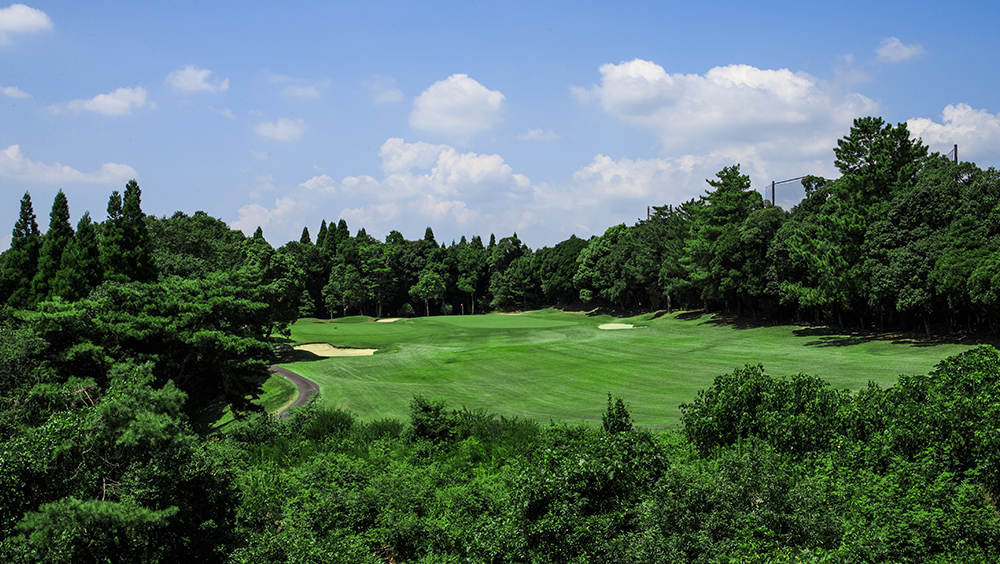

- **ハザード:** 右手前バンカー
- **OB:** 右側OB
- **攻略:** 長めのショート。花道広い。ニアピン推奨。右OBが危険なため左目を狙う。

#### 8番 Par 4 | HDCP 1 | ストレート（OUT最難関）
| バック | レギュラー | レディース |
|--------|------------|------------|
| 430Y | 417Y | 374Y |

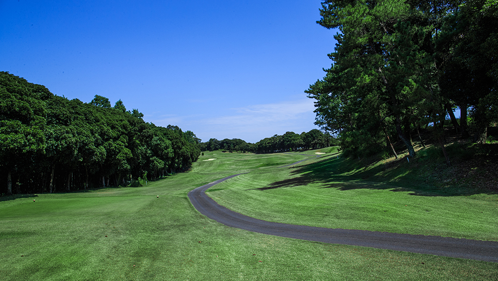

- **ハザード:** 左クロスバンカー（アゴが高い）
- **攻略:** OUT最難関。距離が長く飛距離が求められる。左のクロスバンカーに入るとアゴが高く脱出困難。

#### 9番 Par 4 | HDCP 15 | 左ドッグレッグ
| バック | レギュラー | レディース |
|--------|------------|------------|
| 390Y | 360Y | 332Y |

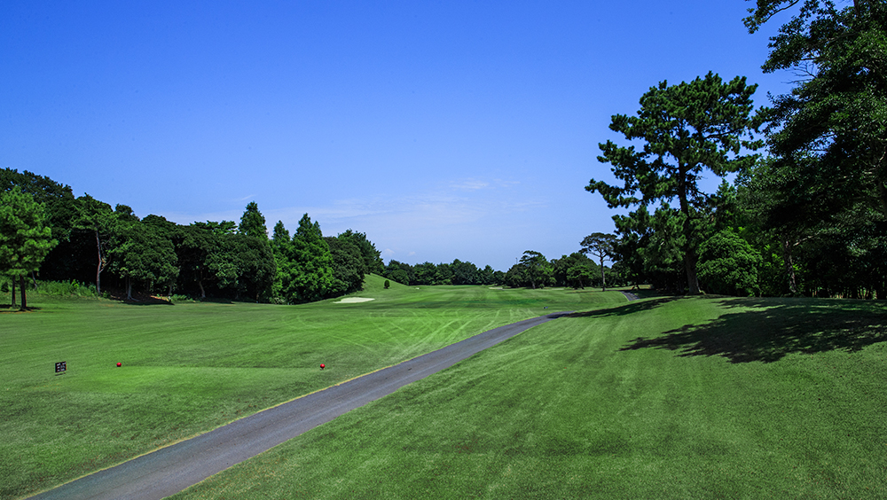

- **攻略:** やや左ドッグレッグ。グリーン奥からのパットが速い。ピン手前に止める距離感が重要。

---

### INコース（Par 36 / バック 3,523Y / レギュラー 3,326Y）

#### 10番 Par 4 | HDCP 4 | ストレート
| バック | レギュラー | レディース |
|--------|------------|------------|
| 446Y | 430Y | 379Y |

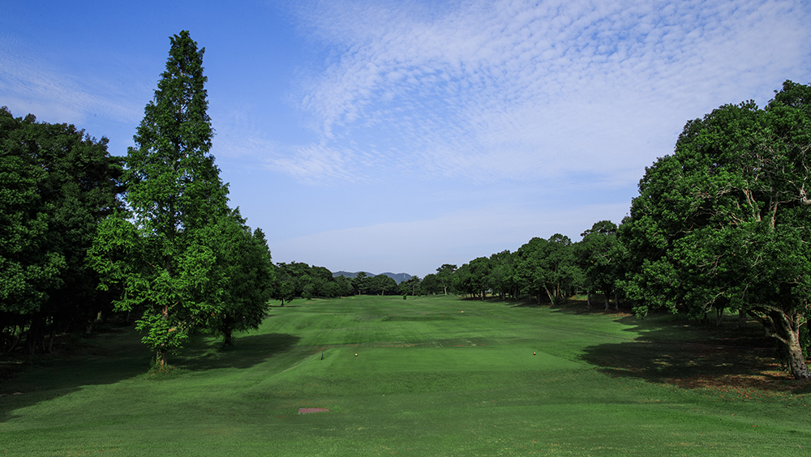

- **攻略:** 長いミドル。左グリーンのアンジュレーションが厳しい。レギュラーティーから400Y超の難関ホール。

#### 11番 Par 5 | HDCP 2 | 右ドッグレッグ（IN最難関・コース最長）
| バック | レギュラー | レディース |
|--------|------------|------------|
| 560Y | 510Y | 472Y |

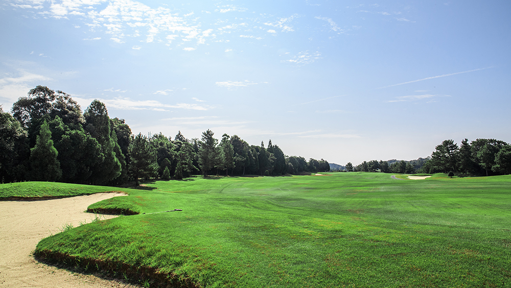

- **攻略:** コース最長のパー5。広いコース設計だが距離がある。3打目の寄せの精度が勝負の分かれ目。

#### 12番 Par 3 | HDCP 18 | ストレート（コース最易）
| バック | レギュラー | レディース |
|--------|------------|------------|
| 153Y | 128Y | 120Y |

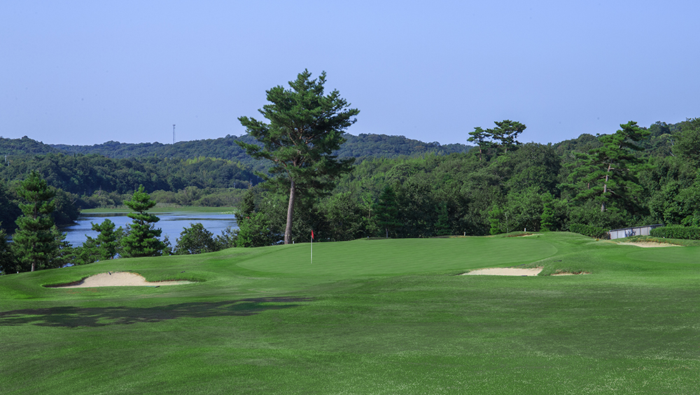

- **OB:** 左側OB
- **攻略:** コース最易の短いショート。ニアピン推奨。左OBに気をつけてセンターからやや右狙い。

#### 13番 Par 4 | HDCP 16 | 左ドッグレッグ
| バック | レギュラー | レディース |
|--------|------------|------------|
| 350Y | 337Y | 322Y |

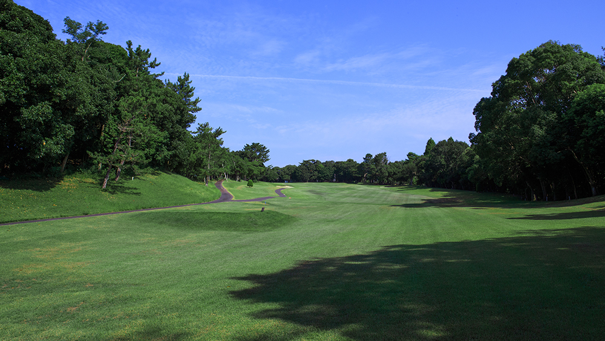

- **ハザード:** 左バンカー
- **OB:** 右側OB
- **攻略:** 左ドッグレッグの短いミドル。OBとバンカーの配置が正確なショットを要求。

#### 14番 Par 4 | HDCP 6 | ストレート
| バック | レギュラー | レディース |
|--------|------------|------------|
| 450Y | 434Y | 381Y |

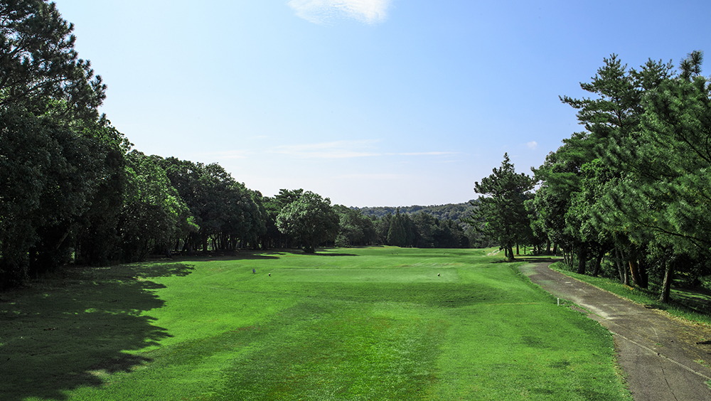

- **ハザード:** FW左傾斜
- **攻略:** 長いミドル。フェアウェイが左に傾斜しており、セカンドが左足下がりのライになりやすい。

#### 15番 Par 5 | HDCP 10 | S字
| バック | レギュラー | レディース |
|--------|------------|------------|
| 507Y | 484Y | 441Y |

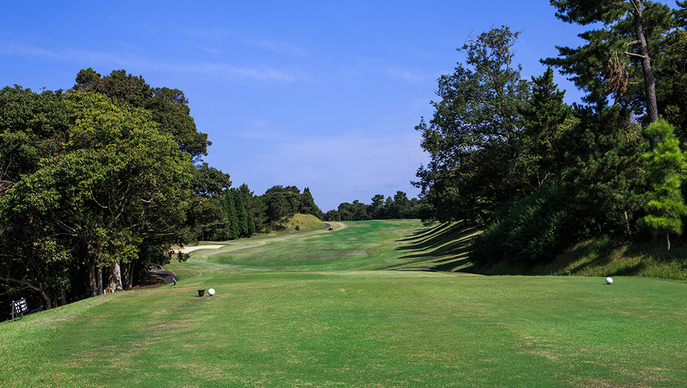

- **ハザード:** バンカー複数配置
- **攻略:** S字ロング。ドラコン推奨。距離は比較的短いパー5でバーディチャンスだが、コースマネジメントが必要。

#### 16番 Par 3 | HDCP 14 | ストレート | 池越え
| バック | レギュラー | レディース |
|--------|------------|------------|
| 210Y | 180Y | 163Y |

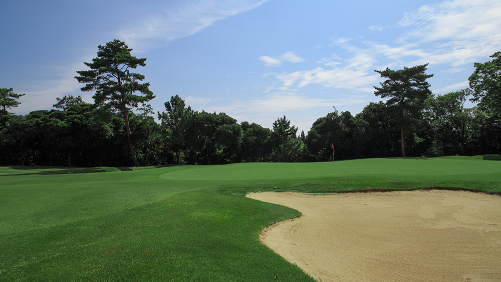

- **ハザード:** グリーン手前に池
- **OB:** 左側OB（浅い）
- **攻略:** 池越え必須の難しいパー3。左OBが浅いため右寄りに狙うのが安全。縦長グリーンでピンの前後位置に注意。

#### 17番 Par 4 | HDCP 8 | 右ドッグレッグ
| バック | レギュラー | レディース |
|--------|------------|------------|
| 452Y | 436Y | 388Y |

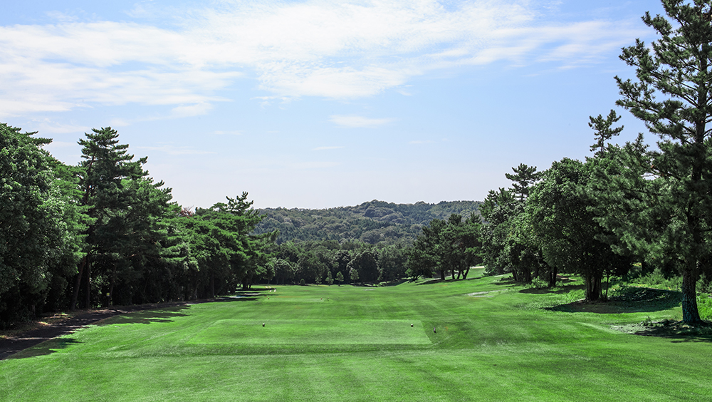

- **ハザード:** 松林がFWを挟む
- **攻略:** コース最難関クラスのホール。右ドッグレッグと松林が正確なティーショットを要求。セカンドも左足下がりで難しい。

#### 18番 Par 4 | HDCP 12 | 左ドッグレッグ | 打ち上げ
| バック | レギュラー | レディース |
|--------|------------|------------|
| 410Y | 394Y | 352Y |

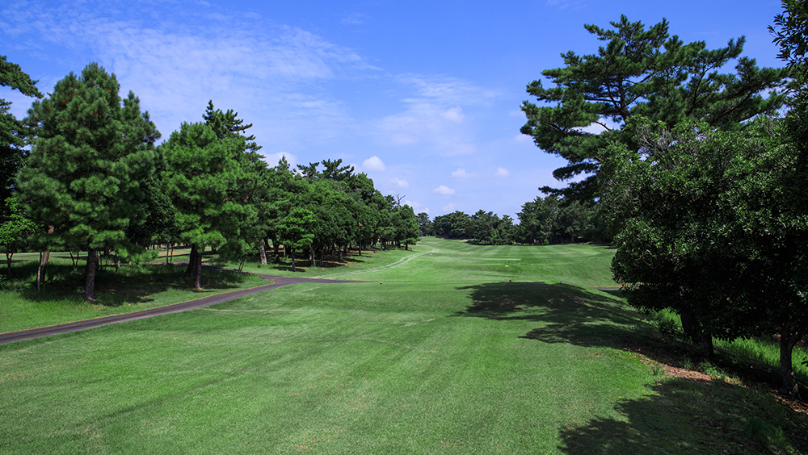

- **ハザード:** グリーン周りバンカー4つ
- **攻略:** 最終ホールは打ち上げの砲台グリーン。グリーンを4つのバンカーがガード。打ち上げ分を計算したクラブ選択が重要。

---

## コース攻略まとめ

| 項目 | 内容 |
|------|------|
| 最難関ホール | 8番（HDCP 1）、11番（HDCP 2）|
| 最易ホール | 12番（HDCP 18）、3番（HDCP 17）|
| 400Y超のPar4 | 8番(417Y)、10番(430Y)、14番(434Y)、17番(436Y) |
| 池が絡むホール | 4番（右サイド池）、16番（池越え）|
| ドラコン推奨 | OUT 5番、IN 15番 |
| ニアピン推奨 | OUT 7番、IN 12番 |
| 全体的な特徴 | 比較的フラットだが一部打ち上げ/打ち下ろしあり。INコースの方が距離があり難易度高め |
